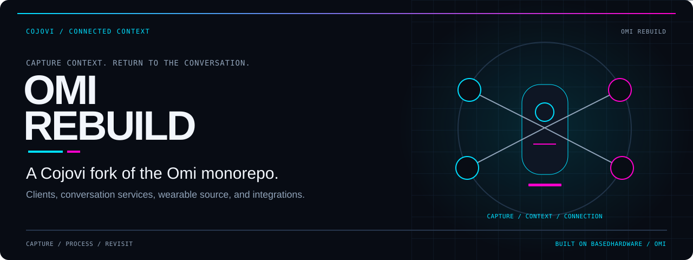
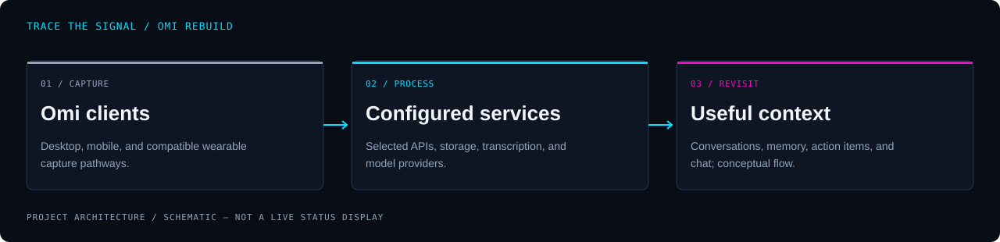

<!-- COJOVI / SIGNAL — Omi fork edition. Commit with readme-assets/. -->
<!-- Documentation presentation adapted for cojovi/cojovi-omi-rebuild; upstream credit and license retained. -->
<a name="top"></a>

<p align="center">
  
</p>

<h1 align="center">Omi Rebuild</h1>

<p align="center">
  <strong>Turn captured context into conversations you can return to.</strong><br>
  Cody / cojovi’s fork of Omi: desktop and mobile clients, conversation services, wearable firmware, and developer integrations.
</p>

<p align="center">
  
</p>

<p align="center">
  <a href="#overview">Overview</a> ·
  <a href="#architecture">Architecture</a> ·
  <a href="#quickstart">Quickstart</a> ·
  <a href="#configuration">Configuration</a> ·
  <a href="#development">Development</a> ·
  <a href="#security">Security</a>
</p>

---

<a name="overview"></a>
## `> meet_omi`

**This repository is a fork of [BasedHardware/omi](https://github.com/BasedHardware/omi), not a separate product implemented from scratch.** Omi brings audio capture, transcription, summaries, action items, memory, and AI chat into a multi-client system. This checkout includes the upstream monorepo's desktop, mobile, backend, firmware, and extension surfaces.

| Capture | Understand | Revisit |
| :--- | :--- | :--- |
| Desktop/mobile clients and compatible wearable pathways collect context with the relevant permissions. | Backend services support transcription, conversation processing, summaries, and action items. | Clients expose conversations, memory, and chat; APIs, SDKs, and MCP provide integration surfaces. |

> [!IMPORTANT]
> **The repository is `cojovi-omi-rebuild`; the runtime and package identities remain Omi.** The capabilities below describe source present in this fork, not a verified list of Cojovi-only additions. No fork-exclusive feature set, hosted service, or independent release channel is claimed. Official downloads and upstream cloud services are not builds of this fork.

<a name="architecture"></a>
## `> trace_the_signal`

<p align="center">
  
</p>

```text
Desktop / mobile / compatible wearable capture
                       ↓
       Configured Omi processing services
       ├─ Python / FastAPI conversation and integration APIs
       ├─ Rust desktop API + TypeScript agent runtime
       └─ identity, storage, transcription, and model providers
                       ↓
           Conversations / memory / action items / chat
```

This is a **conceptual workflow**, not one executable pipeline shared identically by every client. Wearable capture, desktop processing, cloud services, and local test harnesses have different entrypoints and dependencies.

The Python [API entrypoint](backend/main.py) registers conversation, memory, chat, action-item, integration, authentication, and developer routes. The macOS client has a separate Rust service and agent runtime; Windows uses Electron rather than the Swift app.

<a name="quickstart"></a>
## `> choose_your_path`

Start with one component. A root-level `npm install` is not an installation of the entire product, and a Python server alone does not reproduce every upstream service.

### 1. Get this fork

```bash
git clone --branch main https://github.com/cojovi/cojovi-omi-rebuild.git
cd cojovi-omi-rebuild
```

The monorepo includes substantial assets. Use a complete checkout for development; a sparse documentation-audit checkout is not build-ready. Keep [LICENSE](LICENSE) and component notices intact.

### 2. Select an execution environment

| Path | Start here | Boundary |
| :--- | :--- | :--- |
| macOS desktop | [Desktop guide](desktop/macos/README.md) | Swift/SwiftUI app, Rust service, signing and native permissions |
| Windows desktop | [Windows guide](desktop/windows/README.md) | Electron/React, native dependency setup and client configuration |
| Mobile | [App guide](app/README.md) / [setup script](app/setup.sh) | Flutter, platform SDKs, Firebase configuration, device setup |
| Python backend | [Backend agent guide](backend/AGENTS.md) | Python 3.11, locked dependencies, credentials or local harness |
| Local harness | [Makefile](Makefile) / [harness source](scripts/dev-harness/) | Emulators/fake-provider workflows; separate from deployed dev services |

### 3. macOS: deliberate cloud-backed launch

The desktop guide requires **macOS 14+, Xcode/Swift tooling, Node.js/npm, and a usable signing identity**. A local Rust backend also requires the Rust toolchain and its service configuration; the launcher's [help and implementation](desktop/macos/run.sh) list additional tools for each mode.

> [!WARNING]
> **`--yolo` is not an offline sandbox.** It skips local Rust/tunnel startup and targets deployed development services. The desktop guide explicitly notes those services use production Firebase identities and data stores. A named bundle separates local app state, not remote data. Do not use real recordings or credentials until you understand that boundary.

If you intentionally want that cloud-backed path, this command builds and launches a named app while disabling automatic auth/settings seeding:

```bash
cd desktop/macos
OMI_APP_NAME=omi-fork-dev \
OMI_SKIP_AUTH_SEED=1 \
OMI_SKIP_SETTINGS_SEED=1 \
./run.sh --yolo
```

Review recording, accessibility, screen-capture, and automation permissions before granting access. Do not replace or terminate an existing production Omi installation as part of development.

### 4. Backend and mobile alternatives

For backend dependency preparation, install `uv`, then run from the repository root:

```bash
cd backend
./scripts/sync-python-deps.sh
source .venv/bin/activate
```

This script installs the Python version in [backend/.python-version](backend/.python-version) and syncs an OS-specific lock into `.venv`. It does **not** configure Firebase, provider credentials, storage, or every backend service. Follow [backend/AGENTS.md](backend/AGENTS.md) for stage selection, service boundaries, and test prerequisites before launching an API.

For local provider simulation, the repository documents `PROVIDER_MODE=offline make dev-up` from the root. Review [the harness](scripts/dev-harness/) and run its prerequisite checks before use. “Offline” describes fake-provider behavior; provisioning dependencies and tooling may still require network access.

Mobile setup is not a passive installer: [app/setup.sh](app/setup.sh) writes client configuration, installs dependencies, generates code, and invokes `flutter run --flavor dev`. It uses upstream service defaults. Review [app/AGENTS.md](app/AGENTS.md), platform prerequisites, and your desired Firebase/backend targets before running `bash setup.sh ios` or `bash setup.sh android` from `app/`.

<a name="configuration"></a>
## `> configure_context`

There is no single environment file for the monorepo. Keep public client configuration separate from server-side secrets and review the selected component's actual loader.

| Surface | Configuration contract |
| :--- | :--- |
| Python API | [Stage-aware loader](backend/utils/env_loader.py), `OMI_ENV_STAGE`, and `backend/.env` |
| macOS launch | [run.sh](desktop/macos/run.sh), desktop/ Rust templates, `OMI_*` overrides |
| Mobile | `.dev.env` / `.prod.env`, generated environment classes, Firebase/platform configuration |
| Windows | Component `.env.example` and [package scripts](desktop/windows/package.json) |
| MCP | Separate [MCP guide](mcp/README.md) and `mcp-server-omi` package |

### Backend stages

- `local` selects `.env.local-dev`; `offline` selects `.env.offline`.
- `dev` selects `.env.dev`; `prod` selects `.env.prod`.
- Without an explicit stage, `PROVIDER_MODE=offline` selects the offline stage; otherwise the loader uses legacy `.env` behavior.
- Stage files are selected from the backend directory. In normal staged loading, personal `backend/.env` overrides stage defaults, while existing process variables retain priority.
- Offline mode filters provider-secret keys from the personal `.env`; it does not scrub existing process variables. Auth-emulator handling excludes production credential bindings. A harness-supplied `OMI_HARNESS_INSTANCE` skips disk loading entirely.

Start from the matching tracked **template**, not someone else's runtime configuration. Key families include `OPENAI_API_KEY`, `DEEPGRAM_API_KEY`, `SERVICE_ACCOUNT_JSON`, `REDIS_DB_HOST`, and `ENCRYPTION_SECRET`. Required values vary by service and mode; a name in a template is not proof it is needed by every component.

`ADMIN_KEY` enables a development authentication bypass described in the backend guide. Treat it as a privileged secret, never a default shared password. Do not disable TLS verification to work around setup errors, even where older setup notes suggest it.

### Desktop overrides

`OMI_APP_NAME` names a development bundle. `OMI_DESKTOP_API_URL` and `OMI_PYTHON_API_URL` select service targets; `OMI_SIGN_IDENTITY` selects signing identity. The `--yolo` path applies its own service settings, so do not combine it with an assumption that arbitrary URL overrides remain effective.

For an actual local harness, use its documented launch path and local-profile checks rather than treating a named cloud-backed bundle as isolated infrastructure.

<a name="development"></a>
## `> build_with_evidence`

Read [CONTRIBUTING.md](CONTRIBUTING.md), [AGENTS.md](AGENTS.md), and the guide for the component you change. [PRODUCT.md](PRODUCT.md) and [product invariants](docs/product/invariants/) describe behavioral contracts rather than a promise that every deployment enables every feature.

After the component's dependencies and test environment are prepared, these are the repository's component runners, invoked from the root:

```bash
(cd backend && bash test.sh)
(cd app && bash test.sh)
(cd desktop/macos && bash test.sh)
(cd desktop/windows && npm test)
```

Run the relevant runner, not all platforms blindly. Backend integration tests, native UI checks, device tests, and live provider tests have separate prerequisites; unit-test success is not an end-to-end service guarantee.

`make setup` refreshes repository state and installs Git hooks; it is a contributor setup action, not a harmless status command. `make preflight` uses the repository's local check manifest. Review both before running them in a fork or worktree.

**Builds, tests, application startup, device flashing, and provider calls were not run for this docs-only task.** This README is based on a blob-filtered sparse source audit, not a complete runtime or security audit of the monorepo.

<a name="source"></a>
## `> explore_the_system`

| Source | What lives there |
| :--- | :--- |
| [desktop/macos](desktop/macos/) | Swift desktop client, Rust API, TypeScript agent components |
| [desktop/windows](desktop/windows/) | Electron, React, TypeScript desktop client |
| [app](app/) | Flutter mobile client and native platform bridges |
| [backend](backend/) | Python APIs, processing services, database adapters, tests |
| [omi/firmware](omi/firmware/) | Wearable firmware and board-specific development |
| [omiGlass](omiGlass/) | Omi Glass-related application/hardware source |
| [sdks](sdks/) / [mcp](mcp/) | Developer SDKs and standalone MCP integration |
| [web](web/) / [plugins](plugins/) | Web applications and integration/plugin source |
| [docs](docs/) | Product, developer, hardware, and protocol documentation |

The upstream [documentation site](https://docs.omi.me/) is useful context, but its current instructions may differ from this fork's checked-out revision. Prefer source and component docs when identifiers or setup behavior disagree. Official apps and hardware are offered by the upstream project, not by this README.

<a name="security"></a>
## `> draw_the_boundary`

Audio, transcripts, screens, identity tokens, and conversation memory can be sensitive. Obtain recording consent, grant only necessary OS/device permissions, and verify storage, retention, and provider destinations before capture.

- Cloud-backed modes can transmit content off-device. Local clients do not imply local-only processing.
- Keep provider keys, service-account JSON, signing material, local environment files, recordings, and debug logs out of commits and public issues.
- Check runtime API targets and authentication settings before connecting clients; development naming does not guarantee isolated data.
- Local automation and desktop permissions can enable broad access. Review the [desktop guide](desktop/macos/AGENTS.md) before enabling them.
- Follow [SECURITY.md](SECURITY.md) for the repository's security guidance. Report sensitive findings privately, without credentials or user recordings.

### Attribution and license

Omi's original project and core implementation are credited to **[BasedHardware/omi](https://github.com/BasedHardware/omi)** and its contributors. This repository is maintained as the **cojovi/cojovi-omi-rebuild** fork; the documentation presentation is adapted for COJOVI / SIGNAL.

The root [MIT License](LICENSE) retains **Copyright (c) 2024 Based Hardware Contributors**. Preserve its notice and permission terms, plus applicable component and third-party notices. Upstream trademarks, hosted-service terms, and third-party provider access are separate from the source license.

---

<p align="center">
  
</p>

<p align="center">
  <strong>Connected context. Explicit boundaries. Upstream credit intact.</strong><br>
  <sub>A <a href="https://github.com/cojovi">Cody / cojovi</a> fork · <a href="https://cojovi.com">cojovi.com</a><br>
  Built on Omi by Based Hardware contributors. Presented in COJOVI / SIGNAL.</sub>
</p>

<p align="center"><a href="#top">↑ Back to the signal</a></p>
